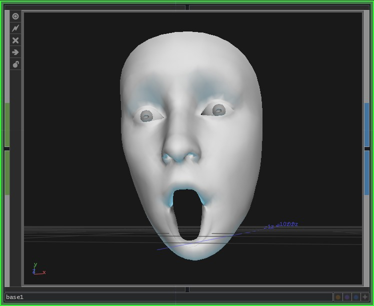

# TD-FaceBlendshapes

Use [ZIG SIM pro](https://zig-project.com/) application to drive face-blendshapes in [TouchDesigner](https://derivative.ca/).

The model file comes from [here](http://blog.kiteandlightning.la/iphone-x-facial-capture-apple-blendshapes/).